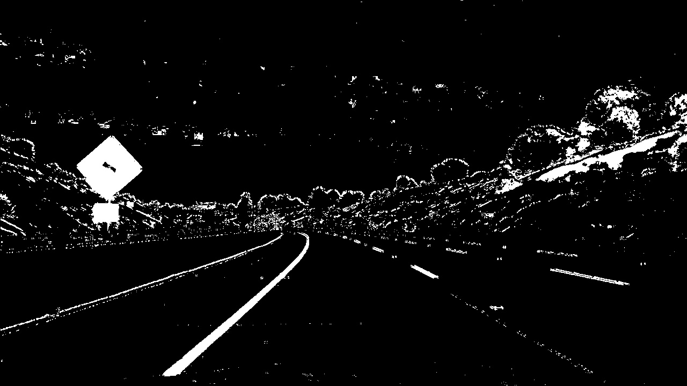
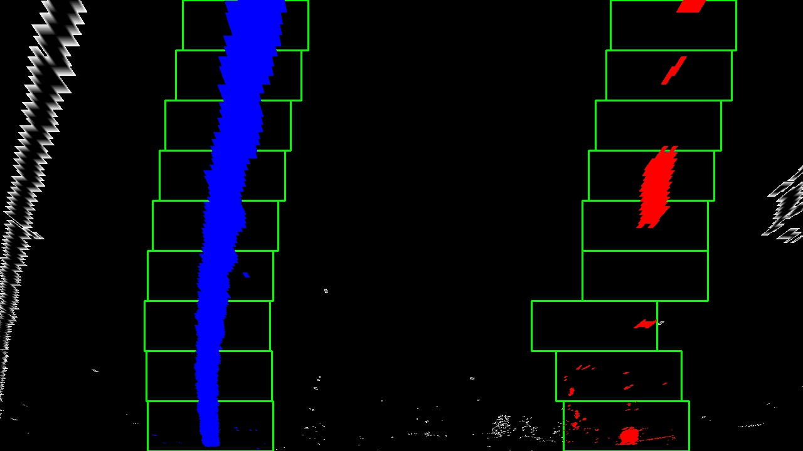
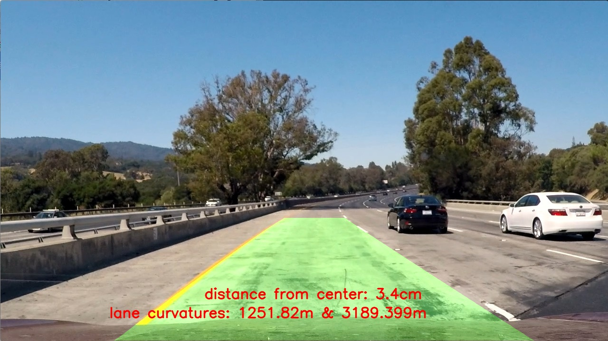

**Advanced Lane Finding Project**

The goals / steps of this project are the following:

* Compute the camera calibration matrix and distortion coefficients given a set of chessboard images.
* Apply a distortion correction to raw images.
* Use color transforms, gradients, etc., to create a thresholded binary image.
* Apply a perspective transform to rectify binary image ("birds-eye view").
* Detect lane pixels and fit to find the lane boundary.
* Determine the curvature of the lane and vehicle position with respect to center.
* Warp the detected lane boundaries back onto the original image.
* Output visual display of the lane boundaries and numerical estimation of lane curvature and vehicle position.

[image1]: ./test_images/test1.jpg "normal"
[image2]: ./output_images/undistorted2.jpg "Undistorted"
[image3]: ./camera_cal/calibration1.jpg "camera_cal"
[image4]: ./output_images/calibrated_camera1.jpg "calibrated Camera"
[image5]: ./examples/warped_straight_lines.jpg "Warp Example"
[image6]: ./examples/color_fit_lines.jpg "Fit Visual"
[image7]: ./examples/example_output.jpg "Output"
[video1]: ./project_video.mp4 "Video"

### Camera Calibration

#### 1. Briefly state how you computed the camera matrix and distortion coefficients. Provide an example of a distortion corrected calibration image.

The code for this step is in a file `camera_cal.py`.

I start by preparing "object points", which will be the (x, y, z) coordinates of the chessboard corners in the world. Here I am assuming the chessboard is fixed on the (x, y) plane at z=0, such that the object points are the same for each calibration image.  Thus, `objp` is just a replicated array of coordinates, and `objpoints` will be appended with a copy of it every time I successfully detect all chessboard corners in a test image.  `imgpoints` will be appended with the (x, y) pixel position of each of the corners in the image plane with each successful chessboard detection.  

I then used the output `objpoints` and `imgpoints` to compute the camera calibration and distortion coefficients using the `cv2.calibrateCamera()` function, line #33.  I applied this distortion correction to the test image using the `cv2.undistort()` function and obtained this result: 

Before:

After:

### Pipeline (single images)

#### 1. Provide an example of a distortion-corrected image.

Before:

After:

#### 2. Describe how (and identify where in your code) you used color transforms, gradients or other methods to create a thresholded binary image.  Provide an example of a binary image result.

I used a combination of color and gradient thresholds to generate a binary image (thresholding steps are in function `abs_sobel_thresh` and color selection is in function `color_select` both are in the file `transformed_img.py`).  Here's an example of my output for this step.

#### 3. Describe how (and identify where in your code) you performed a perspective transform and provide an example of a transformed image.

I performed a perspective transform in lines #56 to #66 in file `transformed_img.py`. My source and destination points are

| Source        | Destination   | 
|:-------------:|:-------------:| 
| 230, 720      | 320, 720        | 
| 1100, 720      | 960, 720      |
| 580, 460     | 320, 0      |
| 700, 460      | 960, 0        |

I verified that my perspective transform was working as expected by drawing the `src` and `dst` points onto a test image and its warped counterpart to verify that the lines appear parallel in the warped image.

#### 4. Describe how (and identify where in your code) you identified lane-line pixels and fit their positions with a polynomial?

This is done in the file `find_lanes.py` in a function called `find_lanes_from_scratch`. First I'm doing a histogram of my
warped image to get a start (bottom points) of left and right lane. Then I use sliding windows to fit in 2nd degree polynomial. The effects:

#### 5. Describe how (and identify where in your code) you calculated the radius of curvature of the lane and the position of the vehicle with respect to center.

I did this in lines functions `find_curvature()` and `car_position()` in a file `find_lanes.py`. I used Udacity measurements with meters per pixel in x and y dimensions.

#### 6. Provide an example image of your result plotted back down onto the road such that the lane area is identified clearly.

I implemented this step in lines #33 - #55 in file `parse_video.py`. Here are the results

---

### Pipeline (video)

#### 1. Provide a link to your final video output.  Your pipeline should perform reasonably well on the entire project video (wobbly lines are ok but no catastrophic failures that would cause the car to drive off the road!).

Here's a [link to my video result](./output_video.mp4)

---

### Discussion

#### 1. Briefly discuss any problems / issues you faced in your implementation of this project.  Where will your pipeline likely fail?  What could you do to make it more robust?

Firstly I found the best combination of color and sobel thresholding by trial and error (and some tips from my classmates). Then I focused on finding lines and this is my best place for improvement because my false lane detecting is not too good. I could smoothen the results, make more use out of the Lane class.
